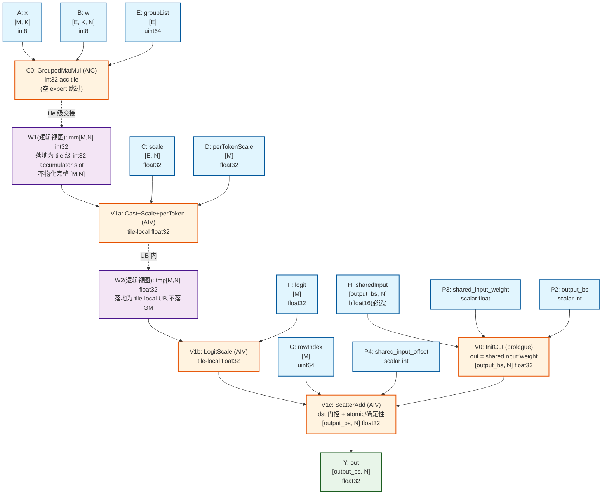

# grouped_matmul_finalize_routing (A8W8 per-token) 算子需求分析与设计说明书

> **文档定位**
>
> 本文档是 `grouped_matmul_finalize_routing` A8W8 per-token benchmark 的正式设计输入。
> 算子契约以同目录 `golden.py` / `proto.yaml` / `cases.yaml` / `cases.csv` 为唯一 ground truth。
> 本文档用于约束 agent 生成实现,同时提供推荐的数据流、tiling 方向、性能门和反模式。
>
> **关键契约摘要**
>
> | 契约项 | 本 benchmark 要求 |
> | :--- | :--- |
> | 精度 | **遵循 `PRECISION_SPEC.md` + `proto.yaml` 的 `precision` 节点**;`out` 走 `intermediate_dtype_inherited`,`intermediate_dtype = bfloat16`(阈值 `2^-7`) |
> | 命名 | 生成算子统一命名 **`grouped_matmul_finalize_routing_a8w8_pertoken_custom`**;kernel `__global__` 名与 host `_do` 入口名必须含 `custom` |
> | 参数命名 | 内部实现统一 **camelCase**(`perTokenScale` / `groupList` / `rowIndex` / `sharedInput`);外部 PTA/aclnn 接口可保留框架约定命名 |

---

## 1. 需求描述

**算子特征**：
- 难度等级：L3（Contraction）

> **章节说明**:本章节为算子概要设计。本算子为参考算子 `grouped_matmul_finalize_routing` 的 **A8W8 per-token dequant + finalize routing** 路径(C→V + finalize 融合)。

### 1.1 需求背景

- **网络模型**:MoE 类 Transformer 模型(混合专家)。本 benchmark 选取 **A8W8 per-token grouped matmul + finalize routing** 主路径。
- **应用场景**:推理。MoE 模型中 token 经路由后按专家分组执行 int8 量化矩阵乘,再对结果做反量化 / 路由权重缩放 / 按行散射累加,本算子将 grouped matmul 与 finalize routing 融合为单 kernel(C→V + finalize),减少内存访问与调度开销。
- **业务目标**:将 grouped_matmul 与 finalize_routing 融合,获得优于「独立小算子拼接(grouped_matmul + finalize_routing 等价 torch 实现)」之和的端到端性能(量化口径见 §4.2)。

### 1.2 需求规格

#### 1.2.1 算子功能

本算子为 **CV 融合类算子**:核心计算包含 Cube 类型的 int8 grouped matmul(按 `groupList` 切分 token 区间)和 Vector 类型的 finalize routing(反量化 + per-channel/per-token/logit 缩放 + sharedInput 残差初始化 + 按 `rowIndex` 的 scatter-add)。两阶段在单 kernel 内以 **C→V** 数据流融合:AIC 产出 int32 accumulator,AIV 在片上完成反量化与散射累加。

**数学公式**

$$
\begin{aligned}
&\textbf{输入}:\\
&\quad \mathbf{x} \in \mathbb{Z}^{M \times K} \ (\text{int8}), \quad \mathbf{w} \in \mathbb{Z}^{E \times K \times N} \ (\text{int8}) \\
&\quad \mathbf{scale} \in \mathbb{R}^{E \times N} \ (\text{float32}), \quad \mathbf{perTokenScale} \in \mathbb{R}^{M} \ (\text{float32}) \\
&\quad \mathbf{groupList} \in \mathbb{N}^{E} \ (\text{uint64}, \text{cumsum 前缀和}), \quad \mathbf{logit} \in \mathbb{R}^{M} \ (\text{float32}) \\
&\quad \mathbf{rowIndex} \in \mathbb{N}^{M} \ (\text{uint64}), \quad \mathbf{sharedInput} \in \mathbb{R}^{B \times N} \ (\text{bfloat16}, \textbf{必选}) \\
&\quad \mathbf{output\_bs} = B, \quad \mathbf{shared\_input\_weight} \in \mathbb{R}, \quad \mathbf{shared\_input\_offset} \in \mathbb{N} \\
&\textbf{GroupList 解析(固定 groupListType=0, cumsum)}:\\
&\quad [s_e, t_e) = [G_{e-1}, G_e), \quad G_{-1} = 0 \\
&\textbf{计算}:\\
&\quad \text{空 expert } (t_e \le s_e) \textbf{ 显式跳过},\ 该 group 贡献为 0 \\
&\quad \mathbf{mm}_{i,j}^{(e)} = \sum_{k=0}^{K-1} \mathbf{x}_{i,k} \cdot \mathbf{w}_{e,k,j}, \quad i \in [s_e, t_e) \\
&\quad \mathbf{tmp}_{i,j} = ((\mathbf{mm}_{i,j}^{(e)} \cdot \mathbf{scale}_{e,j}) \cdot \mathbf{perTokenScale}_{i}) \cdot \mathbf{logit}_{i} \quad (\text{乘法顺序见 §2.2.1}) \\
&\quad \mathbf{out}_{b,j} = \mathbf{sharedInput}_{b,j} \cdot \mathbf{shared\_input\_weight} \quad (\text{prologue, bf16}\to\text{fp32}) \\
&\quad \mathbf{dst} = \mathbf{rowIndex}_{i} + \mathbf{shared\_input\_offset}; \quad \text{仅当 } 0 \le \mathbf{dst} < B:\ \mathbf{out}_{\mathbf{dst}, j} \mathrel{+}= \mathbf{tmp}_{i,j} \\
&\textbf{输出}:\\
&\quad \mathbf{out} \in \mathbb{R}^{B \times N} \ (\text{float32})
\end{aligned}
$$

- **参数信息**

| 序号 | 参数 | 输入或输出 | layout/维度 | 数据类型 |
| :---: | :--- | :--- | :--- | :--- |
| 1 | x | 输入 | [M, K] | int8 |
| 2 | w | 输入 | [E, K, N] | int8 |
| 3 | scale | 输入 | [E, N] | float32 |
| 4 | perTokenScale | 输入 | [M] | float32 |
| 5 | groupList | 输入 | [E] | **uint64** |
| 6 | logit | 输入 | [M] | float32 |
| 7 | rowIndex | 输入 | [M] | **uint64** |
| 8 | sharedInput | 输入(**必选**) | [output_bs, N] | **bfloat16** |
| 9 | groupListType | 属性 | 标量 | int(**固定 0**) |
| 10 | output_bs | 属性 | 标量 | int |
| 11 | shared_input_weight | 属性 | 标量 | float |
| 12 | shared_input_offset | 属性 | 标量 | int |
| 13 | deterministic | 属性 | 标量 | bool(逐 case) |
| 14 | group_list_values | 属性(注入) | list[int],长度 E | int(cumsum,末值=M) |
| 15 | row_index_values | 属性(注入) | list[int],长度 M | int |
| 16 | out | 输出 | [output_bs, N] | float32 |

> **注入参数**:`group_list_values` / `row_index_values` 是用例注入机制,用于在 stage-0 构造 `groupList` / `rowIndex` 的具体取值(见 `golden.py` 顶部:存在时重建为 uint64 覆盖入参)。本路径**必须支持**该机制。

#### 1.2.2 需求基线(Golden,ground truth,禁止改动语义)

以下与同目录 `golden.py` **完全一致**,是正确性的唯一裁判:

```python
def _groups(groupList, groupListType):
    values = [int(v) for v in groupList.detach().cpu().tolist()]
    if groupListType == 0:                 # 本路径固定 0:cumsum 前缀和
        starts = [0] + values[:-1]
        ends = values
    elif groupListType == 1:               # 非本 benchmark 实现范围
        ...
    return list(zip(starts, ends))

def grouped_matmul_finalize_routing(
    x, w, scale, perTokenScale, groupList, logit, rowIndex, sharedInput,
    group_list_values=None, row_index_values=None,
    groupListType=0, output_bs=0, shared_input_weight=1.0,
    shared_input_offset=0, deterministic=False):
    if group_list_values is not None:
        groupList = torch.tensor(group_list_values, dtype=torch.uint64, device=x.device)
    if row_index_values is not None:
        rowIndex = torch.tensor(row_index_values, dtype=torch.uint64, device=x.device)
    groups = _groups(groupList, groupListType)
    e, k, n = w.shape
    if len(groups) != e or x.shape[1] != k or scale.shape != (e, n):
        raise ValueError("shape mismatch")
    tmp = torch.zeros(x.shape[0], n, dtype=torch.float32, device=x.device)
    for idx, (start, end) in enumerate(groups):
        if end <= start:                   # 空 expert 显式跳过,贡献为 0
            continue
        mm = x[start:end].to(torch.float32) @ w[idx].to(torch.float32)
        tmp[start:end] = mm * scale[idx].to(torch.float32).reshape(1, n) \
                            * perTokenScale[start:end].to(torch.float32).reshape(-1, 1)
    tmp = tmp * logit.to(torch.float32).reshape(-1, 1)
    if output_bs <= 0:
        output_bs = sharedInput.shape[0]
    out = sharedInput.to(torch.float32).clone() * float(shared_input_weight)   # prologue 残差
    if out.shape != (output_bs, n):
        raise ValueError("sharedInput must be [output_bs,N]")
    for token in range(tmp.shape[0]):
        dst = int(rowIndex[token].item()) + int(shared_input_offset)
        if 0 <= dst < output_bs:           # dst 门控:越界丢弃
            out[dst] = out[dst] + tmp[token]
    return out
```

**从 golden 必须抽取并落地的语义不变式**(见 §3 实现红线):

1. **空 expert 显式跳过**:`end <= start` 直接 `continue`,贡献为 0;调度层不让 cube 做无效计算、不产生伪贡献。
2. **scatter-add dst 门控**:`dst = rowIndex[token] + shared_input_offset`,仅 `0 <= dst < output_bs` 累加,否则丢弃该 token 贡献。
3. **乘法顺序** `((matmul * scale) * perTokenScale) * logit`(逐步右乘,见 §2.2.1)。
4. **重复 rowIndex 全部累加**:多 token 映射同一 `dst` 时必须全部 scatter-add,**不得覆盖 / 丢更新**;空 bucket 行(无任何 token 写入)由 `sharedInput * shared_input_weight` 直接定义。
5. **sharedInput 必选**:始终存在残差;**不写 `None → zeros` 分支**(golden 直接 `sharedInput.to(fp32).clone()`)。

#### 1.2.3 具体需求

| 序号 | 需求标题 | 硬件平台 | 算子调用通路 | 性能需求 | 精度需求 | 确定性计算 | 非连续 tensor |
| :---: | :--- | :--- | :--- | :--- | :--- | :--- | :--- |
| 1 | A8W8 pertoken gmmfr 融合 | 910B/910C(A2/A3) | 单算子 | 是,duration-only 性能门(见 §4.2) | 遵循 `PRECISION_SPEC.md` + `proto.yaml`(见 §4.1) | **逐 case attr**;atomic fast path 优先,仅 `deterministic=true` 走确定性归约 | **不支持** |

#### 1.2.4 网络 shape 与实现范围

本 benchmark 的 `cases.yaml` / `cases.csv` 共 **20 个正向 case**(1:1 对应),实际覆盖范围如下:

| 参数 | 实际覆盖范围 | 说明 |
| :--- | :--- | :--- |
| E(专家数) | {1, 4, 8, 16, 32} | 含单 expert、E4 top-2、many-experts |
| M(token 总数) | 64 ~ 4096 | 主路径 top-2 时 `M = 2·(output_bs − offset 涉及行)` |
| K(输入特征) | 256 ~ 4096 | 含 k-heavy(K=4096) |
| N(输出特征) | 256 ~ 7168 | 含 max-N(N=7168)、N=5120 |
| output_bs | 16 ~ 2048 | finalize 后输出行数,`= sharedInput.shape[0]` |
| `E·K·N` | ≤ 134M | 控制数据规模,避免 workspace / 权重过大 |

**case 分组**(详见 §4.3):

- **case 1–4:smoke / edge(4 个)**:单 expert(G1)、E4 top-2、空首 expert(E8)、atomic 压力 + 空中间 expert + `offset=4 / weight=2.0`。最大维 `< 512`。
- **case 5–18:MoE 主体(14 个)**:`E∈{8,16,32}`,`M=1024..4096`,`K=2048..4096`,`N=2048..7168`;主路径采用 `M = 2·output_bs` 的 **top-2 routing** 行号模式(每个输出行接收 2 个 token);含 token-heavy(M=4096)、expert-heavy(E=32)、k-heavy(K=4096)、max-N(N=7168 / 5120)、ragged / uneven / empty group 分布。
- **case 19–20:finalize 压力(2 个)**:case 19 覆盖高重复 `rowIndex`、多空 expert 与 `deterministic=true`;case 20 覆盖 `shared_input_offset=64`、shared-only 输出行与 `weight=0.5`。

> **实现边界**:本 benchmark 只要求正确且高性能地实现 A8W8 per-token 主路径,不要求复制其它 dtype、layout 或额外分支。

**非本 benchmark 的泛化范围**

| 维度 | 更广泛实现可能覆盖 | 本 benchmark 实现范围 |
| :--- | :--- | :--- |
| 数据类型 | x/w: int8; scale/perTokenScale/logit: float32; **groupList/rowIndex: uint64**; **sharedInput: bfloat16**; out: float32 | 固定如左 |
| layout | ND | ND;**非连续 tensor 不支持** |
| groupListType | {0 cumsum, 1 count} | **固定 0** |
| M / N | 1 ~ 64K | 64 ~ 4096 / 256 ~ 7168 |
| K | 1 ~ 133152(int32 溢出约束) | 256 ~ 4096 |
| E | 1 ~ 2048 | {1,4,8,16,32} |

---

## 2. 算子设计

> **章节说明**:本章节为概要设计。

### 2.1 接口设计

#### 2.1.1 PTA 接口定义(对外接口示意)

```python
def torch_npu.npu_grouped_matmul_finalize_routing(
    x: torch.Tensor,                  # int8, [M, K]
    w: torch.Tensor,                  # int8, [E, K, N]
    scale: torch.Tensor,             # float32, [E, N]
    per_token_scale: torch.Tensor,   # float32, [M]
    group_list: torch.Tensor,        # uint64, [E]  (cumsum)
    logit: torch.Tensor,             # float32, [M]
    row_index: torch.Tensor,         # uint64, [M]
    shared_input: torch.Tensor,      # bfloat16, [output_bs, N]  (必选)
    *,
    group_list_type: int = 0,        # 固定 0
    output_bs: int = 0,
    shared_input_weight: float = 1.0,
    shared_input_offset: int = 0,
    deterministic: bool = False,
) -> torch.Tensor:                    # out: float32, [output_bs, N]
    ...
```

> 内部实现参数命名统一 **camelCase**(`perTokenScale` / `groupList` / `rowIndex` / `sharedInput`);PTA 对外签名可按框架约定使用 snake_case。

#### 2.1.2 aclnn 两段式接口(接口形式说明)

若接入 aclnn,可采用 `...GetWorkspaceSize` + 执行两段式接口;dtype 必须对齐本契约:`groupList`/`rowIndex` 为 `UINT64`,`sharedInput` 为 `BFLOAT16`(必选),`out` 为 `FLOAT32`。

```cpp
// Stage 1: 计算 workspace 大小
aclStatus aclnnGroupedMatmulFinalizeRoutingGetWorkspaceSize(
    const aclTensor* x, const aclTensor* w, const aclTensor* scale,
    const aclTensor* perTokenScale, const aclTensor* groupList,   // UINT64
    const aclTensor* logit, const aclTensor* rowIndex,            // UINT64
    const aclTensor* sharedInput,                                 // BFLOAT16, 必选
    int64_t groupListType, int64_t outputBs,
    double sharedInputWeight, int64_t sharedInputOffset,
    const aclTensor* out, uint64_t* workspaceSize, aclOpExecutor** executor);

// Stage 2: 执行
aclStatus aclnnGroupedMatmulFinalizeRouting(
    void* workspace, uint64_t workspaceSize, aclOpExecutor* executor, aclrtStream stream);
```

**约束说明(适配契约)**:`x.shape==(M,K)`、`w.shape==(E,K,N)`、`scale.shape==(E,N)`、`perTokenScale/logit/rowIndex.shape==(M,)`、`groupList.shape==(E,)`、`sharedInput.shape==out.shape==(output_bs,N)`;cumsum 模式 `groupList[-1]==M`;`rowIndex[i]+shared_input_offset` 越界则丢弃;int8 取值 `[-128,127]`;K < 133152。**非连续 tensor 不支持**。

### 2.2 算法原理

**步骤 1:Grouped MatMul(int8 → int32 accumulator)**

固定 `groupListType=0`(cumsum):group `e` 的 token 区间 `[s_e, t_e) = [groupList[e-1], groupList[e])`(`groupList[-1]=0`)。空 expert(`t_e ≤ s_e`)**显式跳过**。

$$
\mathbf{mm}_{i,j}^{(e)} = \sum_{k=0}^{K-1} \mathbf{x}_{i,k} \cdot \mathbf{w}_{e,k,j}, \quad i \in [s_e, t_e)
$$

int8×int8 在 int32 精度下累加(K < 133152 不溢出,本 benchmark K ≤ 4096 远满足)。

**步骤 2:反量化 + per-channel/per-token 缩放**

$$
\mathbf{tmp}_{i,j} = (\mathbf{mm}_{i,j}^{(e)} \cdot \mathbf{scale}_{e,j}) \cdot \mathbf{perTokenScale}_{i}
$$

**步骤 3:Logit 缩放**

$$
\mathbf{tmp}_{i,j} = \mathbf{tmp}_{i,j} \cdot \mathbf{logit}_{i}
$$

**步骤 4:Finalize Routing(prologue 残差 + scatter-add)**

- prologue:`out_{b,j} = sharedInput_{b,j} · shared_input_weight`(bf16 → fp32,**必选,始终存在**)。
- scatter-add:`dst = rowIndex_i + shared_input_offset`,仅 `0 ≤ dst < output_bs` 时 `out_{dst,j} += tmp_{i,j}`。多 token 映射同一 `dst` 全部累加。

#### 2.2.1 乘法顺序(精度基准)

乘法顺序保持为:

```text
((matmul * scale) * perTokenScale) * logit
```

与 golden 逐步右乘一致。

> **代数等价变换说明**:允许探索把 `scale` 预合成、或把 per-channel / per-token 系数提前组织成等价乘法/广播形式等**代数等价变换**作为**性能优化点**,前提是满足 §4.1 / `proto.yaml` 的精度门(`out` 走 bf16 阈值 `2^-7`,对累加顺序/cast 顺序有一定容忍)。换言之:乘法顺序是**精度基准语义**,但实现可在精度门内自由做等价重排/合成以提性能;一旦实测误差逼近阈值,再回退到严格逐步乘。

### 2.3 计算流程图

**说明**:展示算法总体逻辑与数据流,不依赖具体硬件。



> **关键落地标注(对应 §4 硬约束)**:
> 上图中 **W1(`mm[M,N]` int32)与 W2(`tmp[M,N]` float32)是「逻辑视图」**,用于表达数据流语义,**落地时不得物化成完整 `[M, N]` 二阶段**。正确落地:**AIC 通过 tile 级 workspace slot / queue 交接 int32 accumulator,AIV 将当前 tile 搬入 UB 后完成 cast/缩放/散射(tile-local epilogue)**;`mm` 仅作 **tile 级 int32 accumulator slot**(ping-pong / queue)交接,`tmp` 仅活在 UB,不落 GM。完整 `contrib[M,N]` 二阶段是已知 **0.11x 反模式**(见 §2.5.2 / §3)。

**节点说明**

| 节点ID | 类型 | 名称 | 数据类型 | 说明 |
|--------|------|------|---------|------|
| A | 输入 | x | int8 | 输入激活,按 groupList 分组 |
| B | 输入 | w | int8 | 专家权重 |
| C | 输入 | scale | float32 | per-channel(per-expert,N 维)dequant scale |
| D | 输入 | perTokenScale | float32 | per-token scale |
| E | 输入 | groupList | **uint64** | cumsum 分组边界 |
| F | 输入 | logit | float32 | per-token routing 权重 |
| G | 输入 | rowIndex | **uint64** | finalize scatter 目标行号 |
| H | 输入 | sharedInput | **bfloat16(必选)** | 共享专家残差输入 |
| V0 | 计算(AIV prologue) | InitOut | float32 | `out = sharedInput*weight`,先于 scatter-add 完成 |
| C0 | 计算(AIC) | GroupedMatMul | int32 | `x[s:e]@w[idx]`,空 expert 跳过 |
| V1a/b/c | 计算(AIV epilogue) | Cast+Scale / LogitScale / ScatterAdd | float32 | tile-local,UB 内完成,dst 门控 |
| W1 | 逻辑视图 | mm | int32 | **tile 级 accumulator slot**(非完整 [M,N]) |
| W2 | 逻辑视图 | tmp | float32 | **UB 内 tile-local**(不落 GM) |
| Y | 输出 | out | float32 | 最终输出 |

### 2.4 Tiling 策略

> 本节给出推荐 tiling 设计:算子类型判定、chunk 分解、Cube 输出 tiling、全局 2D 网格 + sequential/diagonal 分核、Vector 切分、UB buffer 分配。实现可在满足 §3 硬约束和性能门的前提下自适应调整。

#### 2.4.1 算子类型判定

- **算子类别**:CV 融合算子(Cube-Vector 融合)。
- **判定依据**:核心计算含 grouped_matmul(Cube)与 finalize_routing(反量化 + scatter-add,Vector),典型 C→V 融合场景。
- **执行模型**:`KERNEL_TYPE_MIX_AIC_1_2`(AIC 负责 matmul,1C2V — 两个 AIV lane 分摊 epilogue)。

#### 2.4.2 Chunk 切分(任务级分解)

| Chunk | 包含计算 | 输入 | 输出 | 执行单元 |
|-------|---------|------|------|----------|
| **V0** | 输出初始化(prologue) | sharedInput(必选), shared_input_weight | out | Vector(AIV) |
| **C0** | Grouped MatMul(空 expert 跳过) | x, w, groupList | int32 acc tile | Cube(AIC) |
| **V1** | 反量化 + perTokenScale + logit + finalize routing(dst 门控 scatter-add) | int32 acc tile, scale, perTokenScale, logit, rowIndex, out | out | Vector(AIV) |

**聚合决策说明**

- **V0 独立**:`sharedInput*weight` 初始化不依赖 C0,可与 C0 并行/流水;**它是 prologue**(先于任何 scatter-add 完成),完成后做全局同步(如 `SyncAll`)再进入 epilogue。
- **V1 聚合**:`Cast(int32→fp32) → *scale → *perTokenScale → *logit → 按 rowIndex+offset 散射累加 → fp32 写回` 都依赖 C0 的 int32 acc tile,且是连续 element-wise + scatter-add,**中间结果不落地 GM**,**tile-local 完成**。
- **finalize 与缩放聚合**:scatter-add(atomic add 或确定性归约)在 V1 内部完成,避免额外 GM 读写。

#### 2.4.3 Cube 输出 Tiling 与多核分核策略

**基本块划分**

以输出矩阵 `tmp[M, N]`(逻辑视图)为视角,按 `BaseM × BaseN` 切分:

- **A2/A3 芯片**:`BaseM=128, BaseN=256` 仅作为 Cube/L0C 侧初始候选;AIV epilogue 必须按 UB 容量进一步拆分或分 lane 处理。可选降级候选包括 `BaseM=64,BaseN=128`、`BaseM=32,BaseN=256` 等。
- **UB 约束**:不得在 AIV UB 中同时常驻完整 `mm_tile + tmp_tile + out_tile` 三份 `BaseM×BaseN` fp32/int32 buffer。实现必须复用 buffer、按 1C2V lane 切半 tile、或按更小 vtile 消费。
- **K 维度**:`base_k=256`,L0C 累加。

```
对每个 group e,token 范围 [s_e, t_e):
  M_e = t_e - s_e        # 若 M_e == 0(空 expert)直接跳过
  TM_e = ceil(M_e / BaseM)
  TN_e = ceil(N / BaseN)
基本块 (m, n) 属性:
  M' = min(BaseM, M_e - m*BaseM)   # 尾块
  N' = min(BaseN, N - n*BaseN)
```

**全局 2D 网格构建**

所有 group 基本块拼接为全局 2D 网格:

```
TMR = Σ TM_e          # 各 group block 行数累加(空 expert TM_e=0,不占行)
TNC = max(TN_e)       # 短 group 右侧空位跳过,不参与分核
```

每个有效位 `(r, c)`:由行号 `r` 反查所属 `group_id` 和局部行号 `m`;列号 `c` 即局部列号 `n`。

**分核策略选择**

| 策略 | 适用场景 | 本算子选择 |
|------|---------|-----------|
| **sequential** | M 较小,负载均衡好,但同地址冲突严重 | 小 M 回退(M < 256) |
| **diagonal** | M 大,尾块沿对角线均匀分散,缓解同址冲突 | **推荐**(MoE 主体 M 大) |

**选择依据**:MoE 主体 M 大(1024~4096)、E 多(8~32),diagonal 将尾块均匀分散、缓解对同一 `out` 行的同址原子冲突;小 M(如 case 1–4,M<256)回退 sequential。

**多核切分视图(调度抽象)**

调度层只枚举有效 `(group_id, group_row_idx, col_idx)` block,不为右侧空位或空 expert 分配核。全局 row-block 号由各 group 的 `row_blocks` 前缀和得到:

```text
group_info[e] = {
  group_id,
  group_start, group_end,
  row_blocks = ceil((group_end - group_start) / BaseM),
  row_base = sum(row_blocks of previous groups)
}

global row block r = group_info[e].row_base + group_row_idx
column block c      = col_idx
owner_core          = global_block_id % num_cores
```

`sequential` 使用 `(r, c)` 行优先顺序生成 `global_block_id`;`diagonal` 使用对角线顺序生成 `global_block_id`,即先枚举 `d = r - c`,再枚举同一对角线上的 `(r, c)`。两种策略只改变 block 到 core 的分配顺序,不改变每个 tile 的数学语义。

**单核主处理流程(伪代码)**

> **实现要求**:下面 `process_cube_output_tile` 中第 3 步逐行 `out[dst] += tmp[row]` **仅示意语义**,落地必须走**多行 tile epilogue**(见 §2.5.1),不得逐 token 行多次 `DataCopyPad + PipeBarrier`。

```python
def kernel_main(core_id, groupList, n, num_cores, strategy):
    base_m, base_n = 128, 256
    group_info = build_group_info(groupList, base_m)

    if strategy == "sequential":
        process_blocks_for_core_sequential(core_id, group_info, n, base_m, base_n, num_cores)
    elif strategy == "diagonal":
        process_blocks_for_core_diagonal(core_id, group_info, n, base_m, base_n, num_cores)

def build_group_info(groupList, base_m):
    group_info = []
    group_start = 0
    row_base = 0
    for gid, group_end in enumerate(groupList):                         # groupListType 固定 0:cumsum
        group_end = int(group_end)
        token_count = max(0, group_end - group_start)
        row_blocks = (token_count + base_m - 1) // base_m               # 空 expert 为 0
        group_info.append({
            "group_id": gid,
            "group_start": group_start,
            "group_end": group_end,
            "row_blocks": row_blocks,
            "row_base": row_base,
        })
        row_base += row_blocks
        group_start = group_end
    return group_info

def process_blocks_for_core_sequential(core_id, group_info, n, base_m, base_n, num_cores):
    # 行优先遍历所有有效 block,再用 global_block_id % num_cores 分配到核。
    col_blocks = (n + base_n - 1) // base_n
    global_block_id = 0

    for g in group_info:
        for group_row_idx in range(g["row_blocks"]):
            for col_idx in range(col_blocks):
                if global_block_id % num_cores == core_id:
                    process_group_block(g, group_row_idx, col_idx, base_m, base_n, n)
                global_block_id += 1

def process_blocks_for_core_diagonal(core_id, group_info, n, base_m, base_n, num_cores):
    # 对角线遍历有效 block,使尾块和同址写压力更均匀地分散到不同核。
    col_blocks = (n + base_n - 1) // base_n
    total_row_blocks = sum(g["row_blocks"] for g in group_info)
    global_block_id = 0

    for diag in range(-(col_blocks - 1), total_row_blocks):
        for global_row in range(max(0, diag), min(total_row_blocks, diag + col_blocks)):
            col_idx = global_row - diag
            if col_idx < 0 or col_idx >= col_blocks:
                continue

            g, group_row_idx = map_global_row_to_group(global_row, group_info)
            if g is None:
                continue

            if global_block_id % num_cores == core_id:
                process_group_block(g, group_row_idx, col_idx, base_m, base_n, n)
            global_block_id += 1

def map_global_row_to_group(global_row, group_info):
    # global_row 是压缩后的有效 row-block 编号;空 expert 不占编号。
    for g in group_info:
        if g["row_base"] <= global_row < g["row_base"] + g["row_blocks"]:
            return g, global_row - g["row_base"]
    return None, -1

def process_group_block(g, group_row_idx, col_idx, base_m, base_n, n):
    group_id = g["group_id"]
    start_row = g["group_start"] + group_row_idx * base_m
    end_row = min(start_row + base_m, g["group_end"])
    start_col = col_idx * base_n
    end_col = min(start_col + base_n, n)
    if end_row > start_row and end_col > start_col:
        process_cube_output_tile(group_id, start_row, end_row, start_col, end_col)

def process_cube_output_tile(group_id, start_row, end_row, start_col, end_col):
    m_prime = end_row - start_row
    n_prime = end_col - start_col
    base_k = 256
    k_tiles = (K + base_k - 1) // base_k

    # 1. Cube(AIC):K 维切分,L0C 累加,输出 int32 acc tile(进 tile 级交接缓冲,不物化完整 [M,N])
    mm_tile = zeros((m_prime, n_prime), dtype=int32)   # tile-local accumulator slot
    for k_tile in range(k_tiles):
        k_start = k_tile * base_k
        k_end = min(k_start + base_k, K)
        mm_tile += cube_mm(x[start_row:end_row, k_start:k_end],
                           w[group_id, k_start:k_end, start_col:end_col])

    # 2. Vector(AIV)tile epilogue(UB 内完成,tmp 不落 GM):严格乘法顺序见 §2.2.1
    tmp = mm_tile.to(float32)
    tmp *= scale[group_id, start_col:end_col].reshape(1, n_prime)        # per-channel
    tmp *= perTokenScale[start_row:end_row].reshape(m_prime, 1)          # per-token
    tmp *= logit[start_row:end_row].reshape(m_prime, 1)                  # routing

    # 3. finalize routing(语义示意;落地走多行 tile epilogue,dst 门控,atomic/确定性)
    for local_row in range(m_prime):
        dst = rowIndex[start_row + local_row] + shared_input_offset
        if 0 <= dst < output_bs:                                        # dst 门控
            out[dst, start_col:end_col] += tmp[local_row, :]            # scatter-add(全部累加)
```

> sequential / diagonal 两套分核框架遵循以下语义:sequential 按行优先编号取模分核;diagonal 按对角线遍历将 block 均匀分散到各核。空 expert 在构建 `group_info` 时 `row_blocks=0` 自然跳过;右侧空位不生成 `global_block_id`,避免虚假负载影响取模分配。

#### 2.4.4 Vector 计算切分

- Vector 输入来自 Cube 输出(int32 acc tile),vtile 与 Cube ctile 对齐:选 **Tile-Wise-1**(vtile 与 ctile 一一对应)。
- A2/A3 每个 AI Core 有 1 个 Cube + 2 个 Vector(**1C2V**):一个 tile 平均分两份,每个 vector 处理半个 tile。
- 多个 AIV lane 按 collective 语义推进(不应只让 lane0 推进全局进度)。

#### 2.4.5 UB 切分与 Buffer 分配

**UB 预算与 vtile 选择伪代码**

```python
def align_up(x, align=32):
    return ((x + align - 1) // align) * align

def choose_vector_tile(base_m, base_n, ub_size, reserved_size,
                       lanes_per_core=2, double_buffer=True,
                       atomic_fast_path=True):
    """
    C→V 融合:AIC 写 tile 级 accumulator/workspace slot,AIV 消费到 UB 后完成 epilogue。
    目标:为 AIV 选择 vBaseM/vBaseN,保证常驻 buffer、队列元数据、mask 与双缓冲都不超过 UB。
    """
    ub_available = ub_size - reserved_size
    meta_slack = align_up(8 * 1024)        # TQue/flag/mask/临时标量等保守余量
    if ub_available <= meta_slack:
        raise RuntimeError("UB budget too small")

    # 1C2V:先按 M 维将 Cube tile 平均拆给两个 AIV lane;若仍不满足,继续缩小 M/N。
    m_candidates = unique_descending([
        (base_m + lanes_per_core - 1) // lanes_per_core,
        base_m, 96, 64, 48, 32, 16, 8,
    ])
    n_candidates = unique_descending([base_n, 192, 128, 96, 64, 32])

    def tile_bytes(v_m, v_n):
        # mm_tile 是 int32 acc tile;tmp_tile 为 fp32 epilogue tile。
        # 实现可复用 mm/tmp/out buffer,但预算先按保守模式计算,避免 UB 溢出。
        mm_tile = align_up(v_m * v_n * 4)         # int32 accumulator consumed by AIV
        tmp_tile = align_up(v_m * v_n * 4)        # fp32 cast/scale/logit tile
        out_tile = 0 if atomic_fast_path else align_up(v_m * v_n * 4)

        scale_tile = align_up(v_n * 4)            # per-channel scale
        per_token_tile = align_up(v_m * 4)        # perTokenScale
        logit_tile = align_up(v_m * 4)
        row_index_tile = align_up(v_m * 8)        # uint64
        dst_mask_tile = align_up(v_m)             # dst in-bound mask / valid row mask

        streaming_bytes = mm_tile + tmp_tile + out_tile
        staging_bytes = scale_tile + per_token_tile + logit_tile + row_index_tile + dst_mask_tile
        slot_factor = 2 if double_buffer else 1
        return slot_factor * streaming_bytes + staging_bytes + meta_slack

    for v_n in n_candidates:
        if v_n > base_n:
            continue
        for v_m in m_candidates:
            if v_m > base_m:
                continue
            if tile_bytes(v_m, v_n) <= ub_available:
                return v_m, v_n

    # 降级顺序:缩小 vN/vM -> 关闭双缓冲 -> 报告 tiling 不可行。
    if double_buffer:
        return choose_vector_tile(base_m, base_n, ub_size, reserved_size,
                                  lanes_per_core=lanes_per_core,
                                  double_buffer=False,
                                  atomic_fast_path=atomic_fast_path)
    raise RuntimeError("No legal vBaseM/vBaseN fits UB budget")

def unique_descending(values):
    return sorted({int(v) for v in values if int(v) > 0}, reverse=True)
```

| Buffer 用途 | 大小计算 | 对齐 |
|------------|---------|---------|
| mm_tile (int32, accumulator slot) | vBaseM × vBaseN × 4 B | 32B |
| tmp_tile (float32, UB-local,可与 mm/out buffer 复用) | vBaseM × vBaseN × 4 B | 32B |
| scale_tile (float32) | BaseN × 4 B(同 N tile 内复用) | 32B |
| perTokenScale_tile (float32) | vBaseM × 4 B(同 M tile 内 staging) | 32B |
| logit_tile (float32) | vBaseM × 4 B | 32B |
| rowIndex_tile (**uint64**) | vBaseM × **8 B** | 32B |
| out_tile (float32,按需 staging 或直接 atomic 写 GM) | vBaseM × vBaseN × 4 B | 32B |

`vBaseM/vBaseN` 是 AIV 实际消费 tile,必须由 UB budget 推导,不必等于 Cube 侧 `BaseM/BaseN`。静态实现前必须给出 UB 预算,确保所有常驻 buffer、中间 mask、队列元数据和双缓冲空间之和不超过 UB。若 atomic fast path 直接写 GM,`out_tile` 可不常驻 UB;若 deterministic fallback 需要 staged reduce,必须把 `out_tile` 或 partial buffer 计入预算。

> workspace 规模应近似随 `baseM × baseN × slot_count × core_count` 增长,**而非随完整 `M × N`**。`scale[e, n0:n1]` 在同一 N tile 内复用,`perTokenScale/logit/rowIndex` 在同一 M tile 内 staging 到 UB。

### 2.5 性能设计

#### 2.5.1 双缓冲与流水线

- C-V 融合采用双缓冲隐藏 Cube 与 Vector 延迟;明确 Cube / Vector / GM 搬运阶段之间的同步点。
- V0(prologue 初始化)与 C0(grouped matmul)无数据依赖,可按输出 tile 粒度并行/流水;V0 完成 + 全局同步后,epilogue 才开始 scatter-add。
- **多行 tile epilogue**:按 `[validM, validN]` 多行处理,避免逐 token 行多次 `DataCopyPad + PipeBarrier`。
- 参考 AIC/AIV 时序:
  ```text
  AIV prologue writes out (= sharedInput*weight)
  SyncAll
  for each tile:
    AIC produces int32 acc tile -> notifies AIV
    AIV waits -> consumes acc tile -> tile-local cast/scale/logit -> scatter-add to out
             -> notifies AIC that tile buffer can be reused
  ```
  同步原语(`CrossCoreSetFlag`/`WaitFlag`、`SetFlag`/`WaitFlag`、TQue、workspace queue + 必要 `PipeBarrier<PIPE_ALL>`)由实现按性能选择,**只要保证 scatter-add 跨核正确性与 GM 写可见性**。

#### 2.5.2 原子加 vs workspace 分核归约的选择

- finalize_routing 的 scatter-add 涉及多 token 映射同一 `out` 行,需处理跨核竞争。
- **方案 1(atomic fast path,默认优先)**:GM 原子加(`SetAtomicAdd<float>` + `DataCopyPad` + `SetAtomicNone`)。实现复杂度低;本算子**默认走 atomic fast path**(`deterministic=false` 的 case)。
- **方案 2(workspace 分核归约,确定性 fallback)**:每核先写 bounded partial workspace,最后按固定顺序归约到 out,减少原子竞争 / 保证确定性。仅 `deterministic=true` 的 case 走此路径(逐 case attr,见 §1.2.3 / §4.3 case 1/4/19)。
- **选择口径**:atomic fast path 优先;仅当 `deterministic=true`,或 atomic 实测精度逼近阈值(见 §4.1)、高 collision row 压力大时,启用确定性归约(固定顺序分块归约 / 仅对高 collision row 启用 / tile 级 partial)。
- **确定性 workspace 上界**:deterministic fallback 不得为每核物化完整 `[output_bs,N]` partial,也不得退化为完整 `contrib[M,N]` 二阶段。允许的实现是 N tile / high-collision row / group tile 范围内的 bounded partial,其 workspace 必须随 `tile_rows × tile_cols × active_partitions` 增长,并在 `trace.md` 中记录上界。

> **已知性能反模式**:**物化完整 float `contrib[M,N]` 再二次 pass**(`matmul → workspace int32 → full float contrib[M,N] → SyncAll → 二阶段 deterministic finalize → out`)会引入大规模额外 GM 写读、把 routing 聚合变成大量小粒度 AIV `DataCopy+Add+Store`,大 shape 下被 GM 流量 / MTE fence / per-row store / 全局同步主导。该类结构即使正确性全量通过,性能门通常也仅约 **0.11x~0.12x**。实现应使用 tile epilogue 内联完成 scatter-add(见 §2.3 / §3)。

## 3. 实现红线

本节只列实现不可违反的红线。完整算法、数据流、tiling 和性能设计见第 2 章;验收与测试数据见第 4 章。

- **不得改 benchmark 语义**:`golden.py` / `proto.yaml` / `cases.yaml` / `cases.csv` 是唯一裁判;禁止通过修改 cases、缩小 `rowIndex` 重复度、降精度、clamp、round、cast 等方式规避正确性或精度门。
- **必须真融合**:必须生成真正的 Cube + Vector 融合 AscendC kernel;禁止退化为纯 AIV、CPU、torch、Python fallback 或 aclnn 高层组合算子。
- **grouped matmul 必须落 AIC/Cube**:按 `groupList` 切分的 int8 grouped matmul 必须由 AIC/Cube 原语或等价 grouped matmul 模板完成;禁止在 AIV 侧逐元素模拟矩阵乘。
- **finalize 必须落 AIV/Vector 片上**:dequant、`scale/perTokenScale/logit` 缩放、`sharedInput` prologue、`rowIndex` scatter-add 和 `out` 写回必须在片上完成;禁止把散射或累加搬到 host。
- **不得物化完整中间矩阵**:禁止完整 `contrib[M,N]`、完整 `mm[M,N]` 或完整 `[output_bs,N]` per-core partial 二阶段方案;AIC/AIV 交接必须是 tile 级 workspace / queue。
- **必须保证 scatter-add 正确性**:多核 / 多 AIV lane 写同一输出行时必须使用 atomic add 或等价确定性归约,不得丢更新;局部 `PipeBarrier` 不能替代跨核可见性同步。
- **必须保持 `_custom` 命名**:kernel `__global__` 核函数名与 host `_do` 入口名必须含 `custom`,统一命名 `grouped_matmul_finalize_routing_a8w8_pertoken_custom`。
- **禁止热路径标量化**:AscendC 热路径禁止 `GetValue/SetValue` 逐元素循环;应使用块级 / 向量化 / 矩阵原语。
- **禁止读取同名系统实现**:clean-run 生成过程中禁止检索、打开或复制 CANN / OPP 中同名或同族算子实现文件;可使用公开 AscendC API 文档确认函数签名和同步语义。

---

## 4. 验收与测试数据

本节统一定义精度 / 正确性、性能、case、逐张量取值范围和结构证据验收条件。

### 4.1 精度与正确性(硬门)

精度按 **`PRECISION_SPEC.md` + `proto.yaml` 的 `precision` 节点**裁决,本文档不维护独立 atol/rtol 数值表。所有 `cases.yaml` / `cases.csv`(20 个)用例精度必须**全部达标**,不得只通过部分 case 后停止。

本算子精度判定遵循同 benchmark 共享的 [`PRECISION_SPEC.md`](../../../ascendskills/skills/ascendc-cv-design2code-auto/references/benchmark/PRECISION_SPEC.md)。通过条件与阈值参数定义在同目录 `proto.yaml` 的 `precision` 节点:

```yaml
precision:
  outputs:
  - name: out
    dtype: float32
    threshold_rule: intermediate_dtype_inherited
    intermediate_dtype: bfloat16          # 阈值 2^-7(SPEC §4 表)
  small_value_handling:
    threshold: 1.0e-06
    absolute_tolerance: 1.0e-05
```

判据(SPEC §3/§4/§5):排除小值后,`MERE < Threshold` 且 `MARE < mare_multiplier(=10) × Threshold`;小值元素(`|golden| < threshold`)改用绝对容差 `|actual − golden| < absolute_tolerance`。整张量通过 = 小值条件 ∧ 浮点条件。

算子特定说明:

- **`out` 阈值归属:`intermediate_dtype_inherited`,`intermediate_dtype = bfloat16`(阈值 `2^-7`)**。依据:bf16 `sharedInput` 残差进入每一行输出,叠加 int8 matmul → fp32 反量化和 atomic 累加顺序差异;按 SPEC §7.3 取主导误差中间 dtype = bf16。
- **小值特殊处理(走 proto 现有 override)**:`threshold = 1e-6`、`absolute_tolerance = 1e-5`(覆盖 `PRECISION_SPEC.md` §5.1 自适应默认)。覆盖原因:空 expert / 空 rowIndex bucket 对应的 `out` 行仅由 `sharedInput*weight` 定义(无 expert 贡献),可能为极小尺度。
- **特殊值处理**:int8 可为 0;空 expert `end<=start` 跳过且贡献 0;空 rowIndex bucket 输出行由 `sharedInput*weight` 定义;越界 `dst` 丢弃该 token 贡献。
- **数值稳定性**:matmul int32 累加,K < 133152(本 benchmark K ≤ 4096 远满足);`scale/perTokenScale/logit` 由调用方保证无 NaN/Inf;候选输出出现 NaN/Inf 默认判失败。
- **若实测 MARE 仍逼近 `2^-7`**:说明 atomic 累加深度 / token 重复度更高;应优先切换确定性归约,或在 SPEC 中定义专项 "atomic_accumulator" 规则。**禁止**通过缩小 `rowIndex` 重复度、修改 cases、cast、降精度、clamp 等方式规避精度门。

### 4.2 性能(软门,duration-only)

性能门正式裁决采用 **duration-only 口径**:

```text
speedup = sum(base Task Duration(us)) / asc custom Task Duration(us)
```

- 不计 `Task Wait Time`;所有耗时必须来自 msprof `op_summary_*.csv`,**禁止 host 自计时**(`time.perf_counter` / wall-clock)。
- **PASS 同时满足**:① duration-only 加速比 `> 0.9` 的 case 占比 `≥ 80%`;② **无 case** duration-only 加速比 `< 0.5×`;③ 均值 `> 1.0×`。

### 4.3 case 设计(20 个,1:1 对应 cases.yaml/csv)

| case | M | K | N | E | output_bs | deterministic | offset / weight | E·K·N | note |
|---:|---:|---:|---:|---:|---:|:---:|:---|---:|:---|
| 1 | 64 | 256 | 256 | 1 | 64 | true | 0 / 1.0 | 0.1M | smoke 单 expert G1 |
| 2 | 128 | 512 | 512 | 4 | 64 | false | 0 / 1.0 | 1.0M | smoke E4 top-2 |
| 3 | 96 | 256 | 512 | 8 | 48 | false | 0 / 1.0 | 1.0M | smoke 空首 expert E8 |
| 4 | 128 | 256 | 256 | 4 | 16 | true | 4 / 2.0 | 0.3M | smoke atomic 压力 + 空中 expert + offset |
| 5 | 1024 | 2048 | 4096 | 8 | 512 | false | 0 / 1.0 | 67.1M | MoE E8 |
| 6 | 1024 | 4096 | 4096 | 8 | 512 | false | 0 / 1.0 | 134.2M | k-heavy |
| 7 | 2048 | 2048 | 4096 | 8 | 1024 | false | 0 / 1.0 | 67.1M | token-heavy M2048 |
| 8 | 1024 | 2048 | 7168 | 8 | 512 | false | 0 / 1.0 | 117.4M | max-N 7168 |
| 9 | 1024 | 2048 | 4096 | 16 | 512 | false | 0 / 1.0 | 134.2M | E16 |
| 10 | 2048 | 2048 | 2048 | 16 | 1024 | false | 0 / 1.0 | 67.1M | E16 M2048 |
| 11 | 2048 | 2048 | 2048 | 32 | 1024 | false | 0 / 1.0 | 134.2M | expert-heavy E32 |
| 12 | 1024 | 4096 | 1024 | 32 | 512 | false | 0 / 1.0 | 134.2M | E32 K4096 |
| 13 | 2048 | 4096 | 2048 | 16 | 1024 | false | 0 / 1.0 | 134.2M | k-heavy E16 |
| 14 | 1024 | 2048 | 5120 | 8 | 512 | false | 0 / 1.0 | 83.9M | N=5120 |
| 15 | 4096 | 2048 | 2048 | 8 | 2048 | false | 0 / 1.0 | 33.6M | big-M M4096 |
| 16 | 2048 | 2048 | 4096 | 8 | 1024 | false | 0 / 1.0 | 67.1M | ragged groups |
| 17 | 1024 | 2048 | 2048 | 16 | 512 | false | 0 / 1.0 | 67.1M | uneven + empty |
| 18 | 2048 | 4096 | 2048 | 8 | 1024 | false | 0 / 1.0 | 67.1M | k-heavy big-M |
| 19 | 2048 | 2048 | 4096 | 8 | 256 | true | 0 / 1.0 | 67.1M | 高重复 rowIndex + 空 expert(atomic 压力) |
| 20 | 1024 | 2048 | 4096 | 8 | 1024 | false | 64 / 0.5 | 67.1M | shared-only 行 + offset64 + weight0.5 |

每个 case 逐条保持 §2.1 接口契约与 §1.2.4 形状范围:`group_list_values` 长度=E、cumsum 末值=M;`row_index_values` 长度=M 且 `rowIndex+offset ∈ [0,output_bs)`;`scale/perTokenScale/logit/rowIndex/groupList/sharedInput` 与 `[M,K]/[E,K,N]/output_bs` 严格联动。全部 20 个 case 均可被 `golden.py` 无 shape/dtype 错误地消费,输出 `[output_bs,N]`。

> `cases.csv` 框架级 `value_range` 为单一 `[-8, 8]` 的默认范围;**逐张量取值范围**在 stage-0 生成 model.py 时据 §4.4 落实。`baseline_perf_us=0.0`、`t_hw_us=0.0`(由 msprof 实测填充)。
>
> 当前 20 个正向 case 的 `rowIndex + offset` 均在 `[0, output_bs)` 内。`dst` 越界丢弃仍是实现硬语义;若需要单独验证该分支,应新增一个包含部分越界 `rowIndex + offset` 的 gate case。

### 4.4 逐张量取值范围

stage-0 生成 model.py 时按本节落实逐张量取值;`cases.csv` 的 `value_range=[-8,8]` 仅为框架级默认范围,逐张量范围以本节为准,用于避免量级失控导致 fp32 量级溢出或精度门误判。

| 张量 | dtype | 取值范围 | 说明 |
| :--- | :--- | :--- | :--- |
| x | int8 | 全域 `[-128, 127]` | 含 int8 边界值 |
| w | int8 | 全域 `[-128, 127]` | 含 int8 边界值 |
| scale | float32 | 适中正值 `[0.01, 2]` | per-channel dequant,控制数值规模 |
| perTokenScale | float32 | 适中正值 `[0.01, 2]` | per-token,控制数值规模 |
| logit | float32 | `[-10, 10]` | routing 权重,含正负 |
| sharedInput | bfloat16 | 适中范围(如 `[-8, 8]`) | 残差,bf16 量级 |
| groupList | uint64 | 由 `group_list_values` 注入(cumsum,末值=M) | 含空 expert(相邻相等) |
| rowIndex | uint64 | 由 `row_index_values` 注入,`+offset ∈ [0,output_bs)` | 含高重复(top-2 / round-robin) |

**边界 / 特殊数据**:int8 全 0 / 全 1 / 全 -1 / 边界(127, -128);`scale/perTokenScale/logit` 含 0(验证乘法结果);空 expert(相邻 cumsum 相等)、空 rowIndex bucket(某行无 token)、高重复 rowIndex(atomic 压力)、非零 `shared_input_offset`、`shared_input_weight ≠ 1`。

### 4.5 结构证据与设计有效性

主路径**不再物化完整 float `contrib[M,N]`**;dequant / `perTokenScale` / `logit` / `rowIndex` scatter-add 在 **tile epilogue 内**完成;sharedInput 初始化是 **prologue**;AIC/AIV 交接是 **tile 级 workspace** 而非完整输出矩阵二次遍历;`trace.md` 能证明该结构来自 §2 设计数据流与 §3 实现红线,而非后验修补。

**设计有效性通过条件 = §4.2 duration-only 性能门 `PASS`**(且 §4.1 正确性硬门全过)。若最终仍为 `NEEDS_OPTIMIZE` 或 `FAIL`,必须在 `trace.md` / `performance_result.md` 明确写为「设计策略未证明有效」,并给出未达标 case 与下一步瓶颈(matmul tiling / AIC-AIV 同步 / atomic 冲突 / vector epilogue / workspace GM 带宽 / correctness fallback),**不得按成功归档**;只做到结构改善但性能门仍 `NEEDS_OPTIMIZE`,不算设计验证成功。

## 标准 Golden 代码

```python
#!/usr/bin/python3
# coding=utf-8

# ----------------------------------------------------------------------------------------------------------
# Copyright (c) 2026 Huawei Technologies Co., Ltd.
# This program is free software, you can redistribute it and/or modify it under the terms and conditions of
# CANN Open Software License Agreement Version 2.0 (the "License").
# Please refer to the License for details. You may not use this file except in compliance with the License.
# THIS SOFTWARE IS PROVIDED ON AN "AS IS" BASIS, WITHOUT WARRANTIES OF ANY KIND, EITHER EXPRESS OR IMPLIED,
# INCLUDING BUT NOT LIMITED TO NON-INFRINGEMENT, MERCHANTABILITY, OR FITNESS FOR A PARTICULAR PURPOSE.
# See LICENSE in the root of the software repository for the full text of the License.
# ----------------------------------------------------------------------------------------------------------

import torch


def get_input(
    x: torch.Tensor,
    w: torch.Tensor,
    scale: torch.Tensor,
    perTokenScale: torch.Tensor,
    groupList: torch.Tensor,
    logit: torch.Tensor,
    rowIndex: torch.Tensor,
    sharedInput: torch.Tensor,
    **attrs,
) -> list:
    """从 attrs.group_list_values / row_index_values 重建 groupList、rowIndex 张量。

    cases.yaml 将确定性的 cumsum 分组边界放在 group_list_values 属性、行索引放在
    row_index_values 属性（golden 读取它们），但被测 kernel 只看 groupList / rowIndex
    张量。若不由 get_input 重建，这两个张量会被 value_range 随机生成（可能为负、
    非单调），导致 kernel 与 golden 分组/累加目标不一致。返回值同时替换 golden 与
    AI 算子的输入，确保对比公平。
    """
    gl = attrs.get("group_list_values")
    if gl is not None:
        groupList = torch.tensor(list(gl), dtype=torch.uint64, device=x.device)
    ri = attrs.get("row_index_values")
    if ri is not None:
        rowIndex = torch.tensor(list(ri), dtype=torch.uint64, device=x.device)
    return [x, w, scale, perTokenScale, groupList, logit, rowIndex, sharedInput]


def _groups(groupList: torch.Tensor, groupListType: int):
    values = [int(v) for v in groupList.detach().cpu().tolist()]
    if groupListType == 0:
        starts = [0] + values[:-1]
        ends = values
    elif groupListType == 1:
        starts, ends, cur = [], [], 0
        for count in values:
            starts.append(cur)
            cur += count
            ends.append(cur)
    else:
        raise ValueError("groupListType must be 0 or 1")
    return list(zip(starts, ends))


def grouped_matmul_finalize_routing(
    x: torch.Tensor,
    w: torch.Tensor,
    scale: torch.Tensor,
    perTokenScale: torch.Tensor,
    groupList: torch.Tensor,
    logit: torch.Tensor,
    rowIndex: torch.Tensor,
    sharedInput: torch.Tensor,
    group_list_values=None,
    row_index_values=None,
    groupListType: int = 0,
    output_bs: int = 0,
    shared_input_weight: float = 1.0,
    shared_input_offset: int = 0,
    deterministic: bool = False,
) -> torch.Tensor:
    """Torch golden for grouped_matmul_finalize_routing selected path.

    契约 dtype（与 proto.yaml / cases 对齐，v1.2 适配）：
      x/w: int8; scale/perTokenScale/logit: float32;
      groupList/rowIndex: uint64; sharedInput: bfloat16; out: float32。
    注入参数 group_list_values/row_index_values 重建为 uint64 以贴合契约；
    内部经 _groups()/.item() 取 python int 使用，sharedInput 经 .to(float32) 反量化，dtype 安全。
    """
    if group_list_values is not None:
        groupList = torch.tensor(group_list_values, dtype=torch.uint64, device=x.device)
    if row_index_values is not None:
        rowIndex = torch.tensor(row_index_values, dtype=torch.uint64, device=x.device)
    groups = _groups(groupList, groupListType)
    e, k, n = w.shape
    if len(groups) != e or x.shape[1] != k or scale.shape != (e, n):
        raise ValueError("shape mismatch")
    tmp = torch.zeros(x.shape[0], n, dtype=torch.float32, device=x.device)
    for idx, (start, end) in enumerate(groups):
        if end <= start:
            continue
        mm = x[start:end].to(torch.float32) @ w[idx].to(torch.float32)
        tmp[start:end] = mm * scale[idx].to(torch.float32).reshape(1, n) * perTokenScale[start:end].to(torch.float32).reshape(-1, 1)
    tmp = tmp * logit.to(torch.float32).reshape(-1, 1)
    if output_bs <= 0:
        output_bs = sharedInput.shape[0]
    out = sharedInput.to(torch.float32).clone() * float(shared_input_weight)
    if out.shape != (output_bs, n):
        raise ValueError("sharedInput must be [output_bs,N]")
    for token in range(tmp.shape[0]):
        dst = int(rowIndex[token].item()) + int(shared_input_offset)
        if 0 <= dst < output_bs:
            out[dst] = out[dst] + tmp[token]
    return out
```
